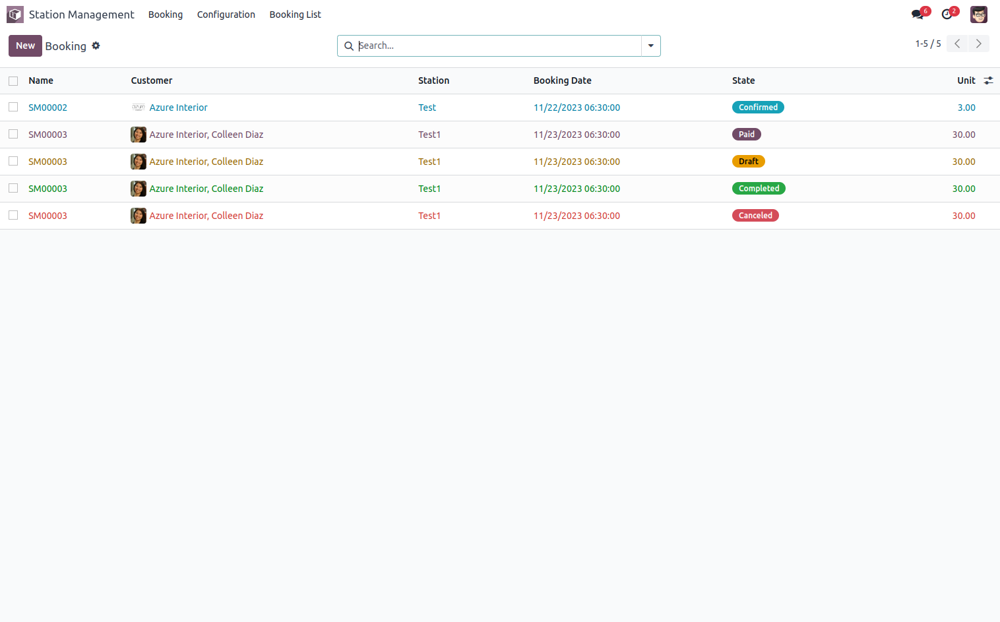
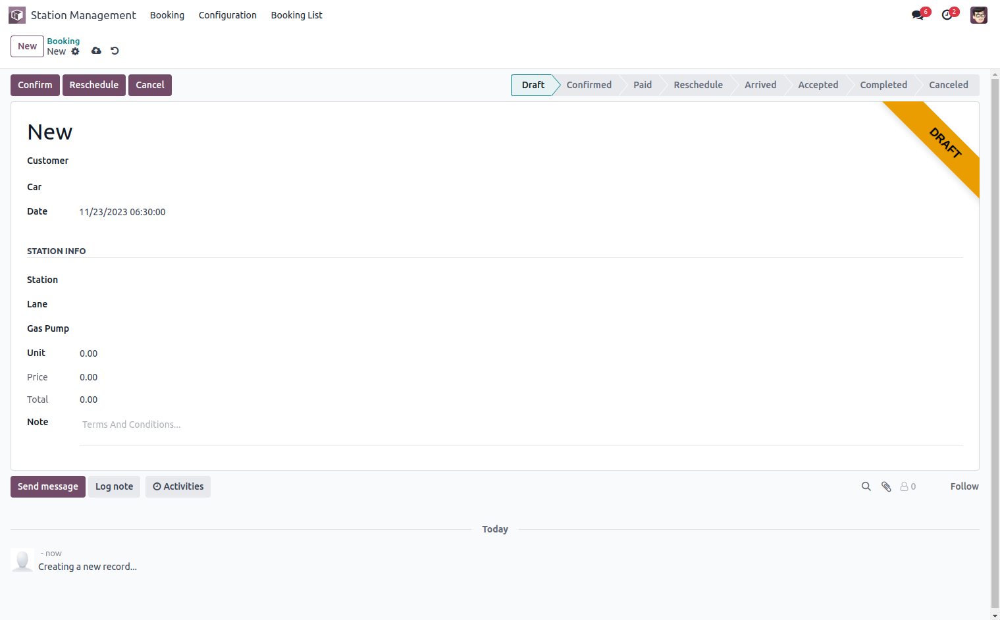
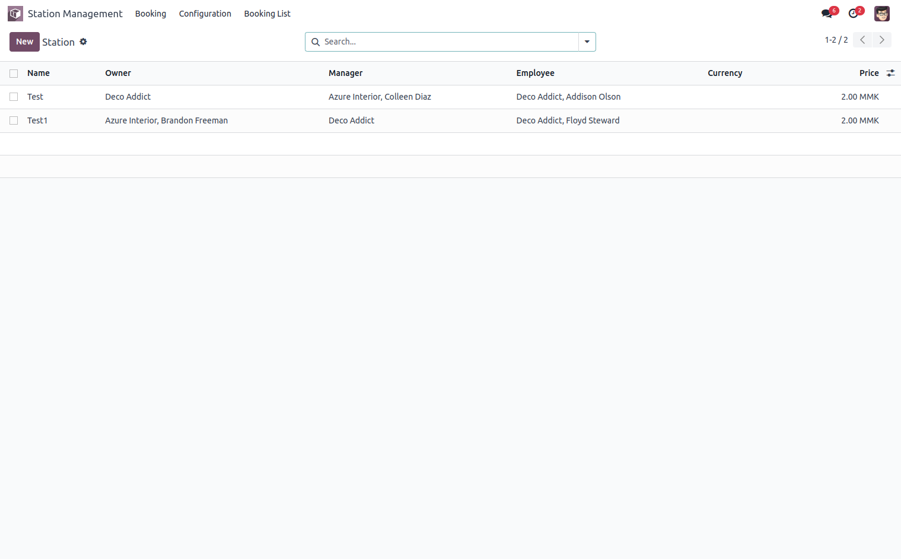
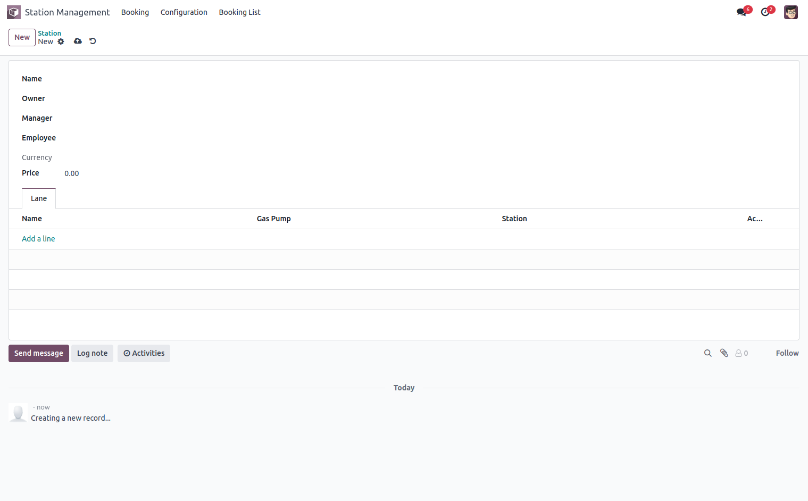
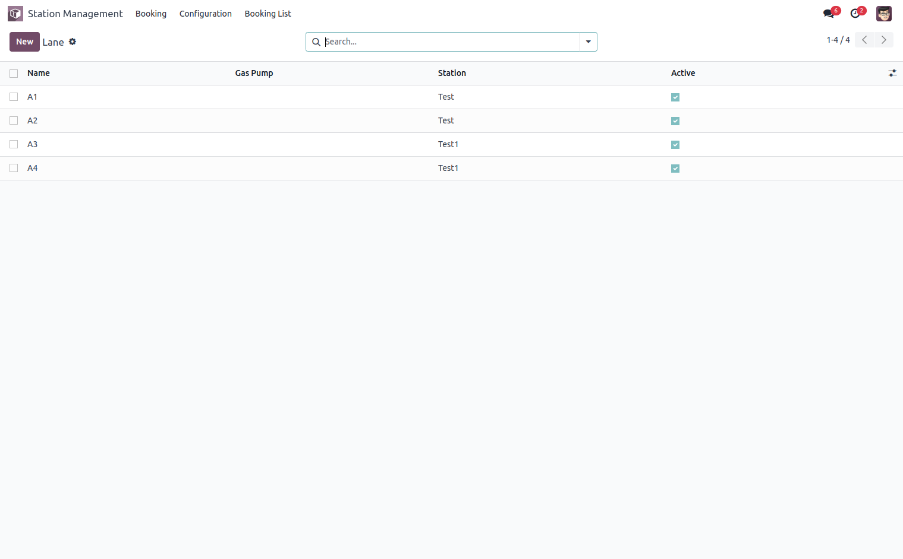
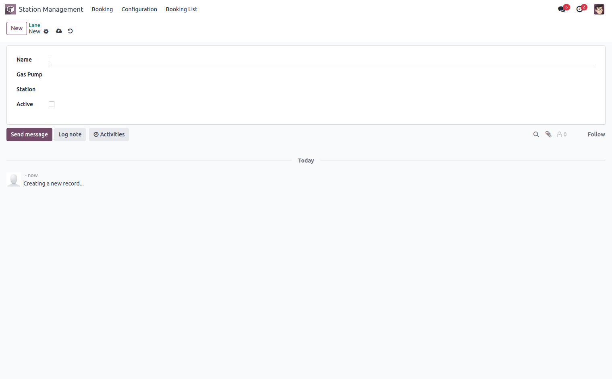
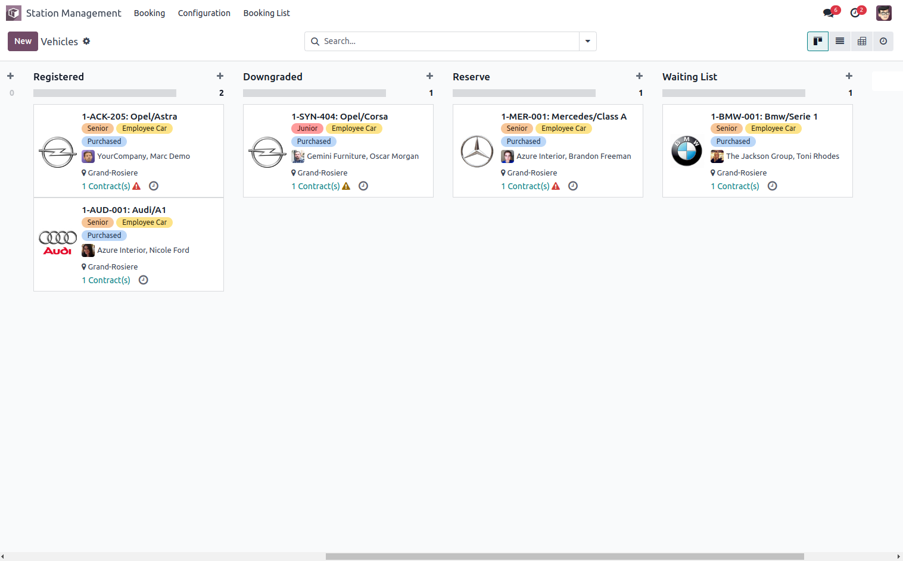
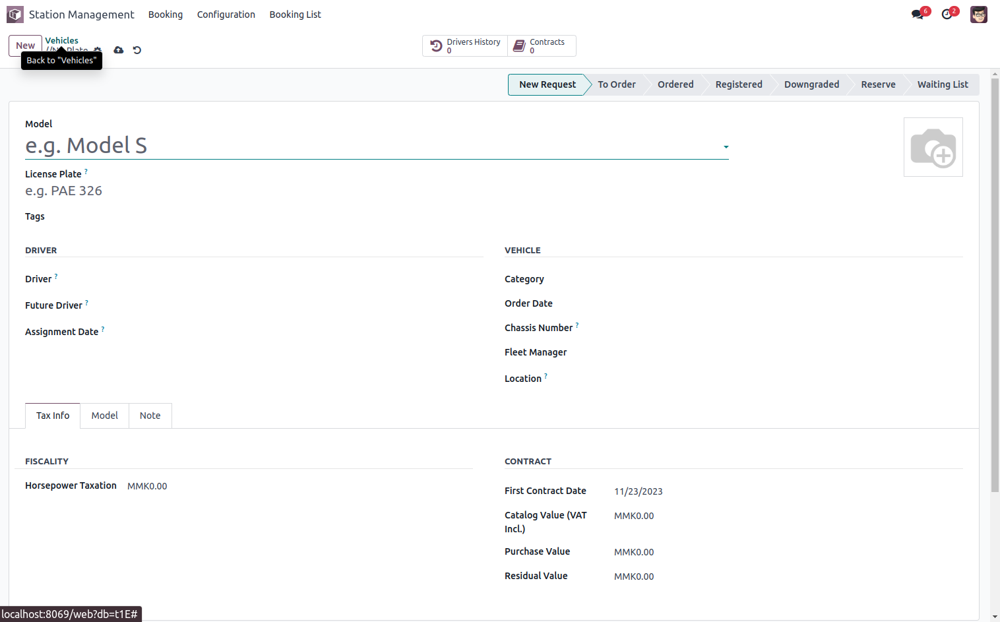
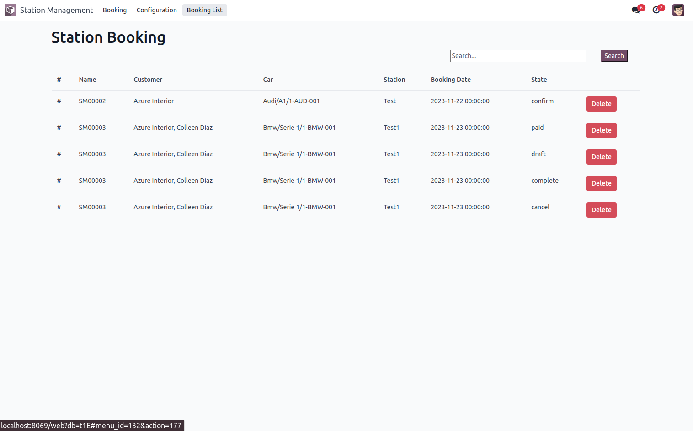
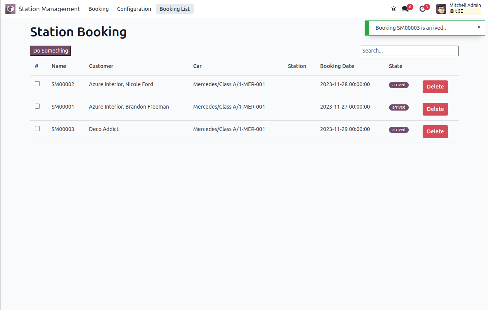

# Station Management

The Gas Station Management System is developed for a smooth operation of a gas station and 
ensuring efficient customer service.

### **Key Highlights**

- Booking
- Station Management
- Fleet Management
- Booking List

### **Booking**
Our booking model for station management is  designed for various station services.
  

### **Station Management**

Our station management model offers a centralized solution for overseeing all station functions, 
including employee station assignments and lane management. Go to **Confiugration>>Station** menu  

  

  In our station lane model, we have incorporated features to efficiently manage station operations, 
including both the fueling lane and gas pump facilities

### **Fleet Management**

In the Fleet model, you can initiate all vehicle processes, select drivers, and 
provide comprehensive details about the engine.
  For more details **Configuration >> Car** menu,   

### **Booking Real Time**
This menu is designed for regular search, booking, real time change state notificatin and deletion of bookings using the Odoo client action implemented in Owl JS.  
  
When you change the booking state to 'Arrived', it will trigger a real-time notification on the client side in Odoo.
